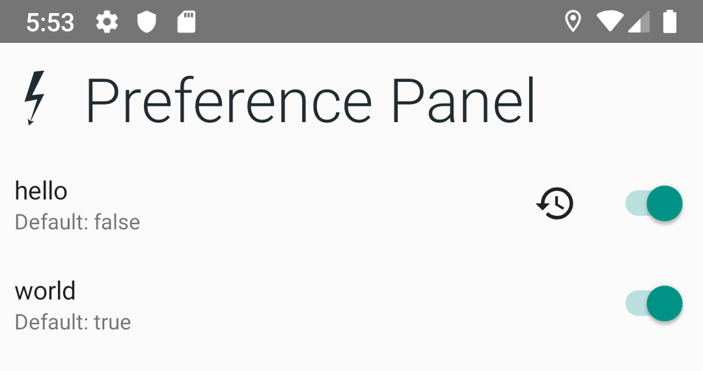

Switchgear
==========


A feature toggle and app configuration toolset.

Installation
------------

This library uses the [JitPack Repository]
If you haven’t already, add JitPack to your gradle repositories in your build.gradle file:

```gradle
repositories {
    maven {
        url "https://jitpack.io"
    }
}
```

[Jitpack Repository]: https://jitpack.io

```gradle
dependencies {
    implementation "com.github.InkApplications.Switchgear:switchgear:+" // Replace with specific version

    // Android only:

    // If you're using Firebase Remote Config:
    implementation "com.github.InkApplications.Switchgear:provider-firebase:+"  // Replace with specific version
    // If you're using the SharedPreference Control Panel
    implementation "com.github.InkApplications.Switchgear:android-control-panel:+"  // Replace with specific version
    // If you're using SharedPreferences without the control panel.
    implementation "com.github.InkApplications.Switchgear:provider-sharedpreferences:+"  // Replace with specific version
}
```

Configuration Providers
-----------------------

A Configuration provider is a class that looks up a current configuration's
value. Your application can have multiple configuration providers, which can
look up settings from different sources.

### (Android) Shared Preferences

The `SharedPreferencesConfigProvider` class can be used to get and set
configuration parameters using SharedPreferences.

```kotlin
class MyApplication: Application() {
    val sharedPreferencesConfig = SharedPreferencesConfigProvider
    val appConfig: AppConfig = PrioritizedConfig(
        sharedPreferencesConfig(this)
    )
}
```

### (Android) Firebase Remote Config

The `RemoteConfigProvider` class can be used to retrieve configuration from
Firebase.

```kotlin
class MyApplication: Application() {
    val appConfig: AppConfig = PrioritizedConfig(
        RemoteConfigProvider(firebaseRemoteConfig)
    )
}
```

Creating your AppConfig
-----------------------

### Priority-Config

A `PriorityConfig` allows you to search one or more configuration providers
before using the default value of the parameter.

The providers will be invoked in the order they are specified. For example:

For example, if you want the config to use Firebase Remote Config but have
SharedPreferences override it, you can create a config like this:

```kotlin
class MyApplication: Application() {
    val appConfig: AppConfig = PrioritizedConfig(
        SharedPreferencesConfigProvider(this),
        RemoteConfigProvider(firebaseRemoteConfig)
    )
}
```

Creating a Configuration Parameter
----------------------------------

Parameters are the settings that you will interact with to control your
application.

Parameters can be declared as static variables:

```kotlin
val TEST_PARAMETER = Parameter.Switch(key = "myparameters.test", default = false)
```

Retrieving a parameter's current value can be done through your `AppConfig`
class.

```kotlin
class MyApplication: Application() {
    val appConfig: AppConfig = PrioritizedConfig(
        SharedPreferencesConfigProvider(this),
        RemoteConfigProvider(firebaseRemoteConfig)
    )

    fun test() {
        if (appConfig.getConfig(TEST_PARAMETER)) {
            Log.d("Test was enabled!")
        }
    }
}
```

### Parameter types

Currently Switchgear only supports boolean `Switch` parameters. More soon!

Panels
------

Panels are pre-built UI's that allow you to view and modify the state of
configuration flags.

### Android SharedPreferences Panel

The Android SharedPreferences panel allows you to view and override
configurations stored in SharedPreferences at the press of a button.



Launching the Panel is as easy as starting the with a list of parameters
to be displayed:

```kotlin
class MyActivity: Activity() {
    private val myParameters = listOf(TEST_PARAMETER)

    fun showControlPanel() {
        startControlPanel(myParameters)
    }
}
```

The panel uses the `SharedPreferencesConfigProvider` to change
configurations. You must be using this to use the Panel. It is
**highly recommended** that the SharedPreferencesConfigProvider be the
first/top listed Configuration Provider when creating you AppConfig.

Dependency Injection
--------------------

Switchgear is designed to work with Dependency Injection frameworks like
[Dagger].
The configuration setup can be leveraged by creating a multibind collection
for all of your application Parameters.

For Example:

```kotlin
val MY_PARAMETER = Parameter.Switch("my.parameter", false)

@Module class MyModule {
    @Provides @IntoSet fun myParameter(): Parameter<@JvmSuppressWildcards Any> = MY_PARAMETER
}
```

Allows you to launch services like the Control Panel with application-wide
parameters easily:

```kotlin
class MyActivity: Activity() {
    @Inject lateinit var myParameters: Parameter<@JvmSuppressWildcards Any>

    fun showControlPanel() {
        startControlPanel(myParameters)
    }
}
```

This will also allow Firebase to be initialized with parameters as their
default value map:


```kotlin
class MyActivity: Activity() {
    @Inject lateinit var remoteConfig: FirebaseRemoteConfig
    @Inject lateinit var myParameters: Parameter<@JvmSuppressWildcards Any>

    fun loadFirebaseDefaults() {
        Log.i("Setting Firebase Config Defaults")
        parameters.map { it.key to it.default }
            .toMap()
            .let(config::setDefaultsAsync)
            .addOnSuccessListener {
                Log.i("Defaults Set")
            }
    }
}
```

[Dagger]: https://dagger.dev
