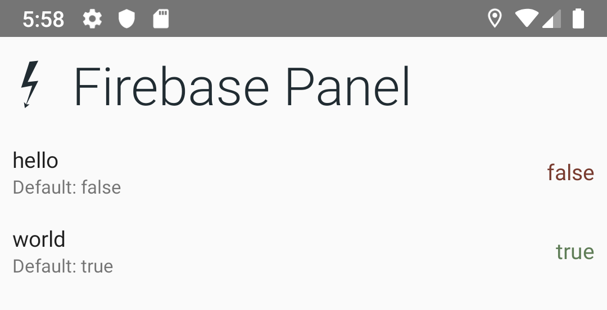

Switchgear
==========


A feature toggle and app configuration toolset.

Installation
------------

This library uses the [JitPack Repository]
If you haven’t already, add JitPack to your gradle repositories in your build.gradle file:

```gradle
repositories {
    maven {
        url "https://jitpack.io"
    }
}
```

[Jitpack Repository]: https://jitpack.io

```gradle
dependencies {
    implementation "com.github.InkApplications.Switchgear:switchgear:+" // Replace with specific version

    // Android only:

    // If you're using Firebase Remote Config:
    implementation "com.github.InkApplications.Switchgear:provider-firebase:+"  // Replace with specific version
    // If you're using the SharedPreference Control Panel
    implementation "com.github.InkApplications.Switchgear:android-control-panel:+"  // Replace with specific version
    // If you're using SharedPreferences without the control panel.
    implementation "com.github.InkApplications.Switchgear:provider-sharedpreferences:+"  // Replace with specific version
}
```

Set-Up
------

### Define a Parameter

A parameter is a configuration, such as a feature flag or an arbitrary string
that can be changed for your application.

```kotlin
val MY_FEATURE_FLAG = requiredParameter("my_feature", false)
val WELCOME_MESSAGE = optionalParameter("welcome_message")
```

Parameters can be _required_ or _optional_. Required parameters require a
default value to use and cannot be `null`. Optional parameters can have a `null`
default value if no value is specified by a Configuration Provider.

### Initialize Switchgear

At the start of your application, such as `Application.onCreate`,
initialize Switchgear with a list of parameters and [Providers] for loading those
parameters.

```kotlin
Switchgear.initialize(
    providers = listOf(
        SharedPreferencesConfigProvider(application),
        RemoteConfigProvider(remoteConfig)
    ),
    parameters = listOf(
        MY_FEATURE_FLAG,
        WELCOME_MESSAGE
    )
)
```

Configuration providers are invoked in order until a value is found.
If no value is found, the parameter's default will be used.

[Providers]: #configuration-providers

Read a Config
-------------

Reading a config is as easy as accessing it from Switchgear:

```kotlin
if(Switchgear[MY_FEATURE_FLAG]) {
    // Feature enabled!
}
```

Panels
------

Panels are pre-built UI's that allow you to view and modify the state of
configuration flags.

### Android SharedPreferences Panel

The Android SharedPreferences panel allows you to view and override
configurations stored in SharedPreferences at the press of a button.


The SharedPreference panel can be used as an Activity by starting
`SharedPReferencesPanelActivity` or as a Fragment via
`SharedPreferencesPanelFragment`

The panel uses the `SharedPreferencesConfigProvider` to change
configurations. You must be using this to use the Panel.

### Firebase Panel

The Firebase Panel allows you to inspect the currently loaded values from
RemoteConfig.
Note: You cannot change values from Firebase with this panel.



You can launch the Firebase panel by starting the `FirebasePanelActivity`
or by using the `FirebasePanelFragment`

Configuration Providers
-----------------------

A Configuration provider is a class that looks up a current configuration's
value. Your application can have multiple configuration providers, which can
look up settings from different sources.

### (Android) Shared Preferences

The `SharedPreferencesConfigProvider` class can be used to get and set
configuration parameters using SharedPreferences.

```kotlin
class MyApplication: Application() {
    val sharedPreferencesConfig = SharedPreferencesConfigProvider
    val appConfig: AppConfig = PrioritizedConfig(
        sharedPreferencesConfig(this)
    )
}
```

### (Android) Firebase Remote Config

The `RemoteConfigProvider` class can be used to retrieve configuration from
Firebase.

```kotlin
class MyApplication: Application() {
    val appConfig: AppConfig = PrioritizedConfig(
        RemoteConfigProvider(firebaseRemoteConfig)
    )
}
```

Note: Because Firebase requires its own set of defaults, this provider will
always return a result, terminating the chain of providers. Therefore, it should
always be the last provider on the list of providers.

Dependency Injection
--------------------

Switchgear is designed to work with Dependency Injection frameworks like
[Dagger].
The configuration setup can be leveraged by creating a multibind collection
for all of your application Parameters.

For Example:

```kotlin
val MY_PARAMETER = requiredParameter("my_parameter", false)

@Module class MyModule {
    @Provides @IntoSet fun myParameter(): @JvmSuppressWildcards Parameter<out Any> = MY_PARAMETER
}
```

Allows you to initialize your DI without manually adding each parameter in your
Application class:

```kotlin
class MyApplication: Application() {
    @Inject lateinit var myParameters: @JvmSuppressWildcards Parameter<out Any>

    fun onCreate() {
        Switchgear.initialize(
            providers = listOf(
                SharedPreferencesConfigProvider(application),
                RemoteConfigProvider(remoteConfig)
            ),
            parameters = myParameters
        )
    }
}
```

This will also allow Firebase to be initialized with parameters as their
default value map:

```kotlin
class MyActivity: Activity() {
    @Inject lateinit var remoteConfig: FirebaseRemoteConfig
    @Inject lateinit var myParameters: @JvmSuppressWildcards Parameter<out Any>

    fun loadFirebaseDefaults() {
        Log.i("Setting Firebase Config Defaults")
        parameters.map { it.key to it.default }
            .toMap()
            .let(config::setDefaultsAsync)
            .addOnSuccessListener {
                Log.i("Defaults Set")
            }
    }
}
```

[Dagger]: https://dagger.dev
